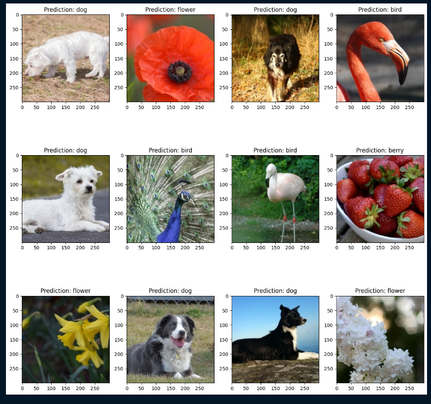

# Vision Transformer

Vision Transformer (ViT) is a type of neural network architecture that has been introduced to address the problem of image classification. Unlike traditional convolutional neural networks (CNNs), which rely on convolutions to extract local features from an image, ViT employs a self-attention mechanism to extract global features for classification.

Containerize  the training and inference pipeline using .


# Requirements

```
pip install torch==1.11.0+cu113 torchvision==0.12.0+cu113 -f https://download.pytorch.org/whl/torch_stable.html
pip install transformers==4.22.1
```

# 1. Train Vision Transformer model 
## __Preprocess the Data__

Which containt 4 classes: 

    1) berry 

    2) bird 

    3) dog 

    4) flower

In this class containts some outlier like berry class folder containt other object. defined those object data we can remove outlier.


```
dataset
    ├── train[class_folder and it's image]
    └── test [class_folder and it's image]   
```

## __Apply augmentation__

Run ```data_augmentation.py``` script
```py
python data_augmentation.py

```


## __Build Classifier which will be able to classify the input photo to one of the 4 classes__
Check the config file ```config.py``` script for data path as well as below this mention variable.
```
# Make sure the dataset path directory

DATASET_PATH = "/dataset"

EPOCHS = 20

```
Run.

```
python train_vit.py

```

## __training Graph__

this plot matrices will save into log directory.


## __Prove that your model is not overfitted__

Model Evaluation run ```vit_eval.py``` script,

```
python vit_eval.py

```
Evaluation Training model.


Inference Grid.


